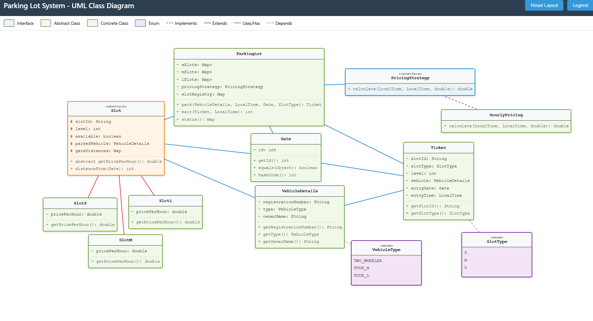

# Parking Lot System

A multi-level parking lot management system with slot allocation, pricing, and ticket validation.

## Class Diagram



## Build & Run

```bash
javac -d bin src/com/parkinglot/*.java
java -cp bin com.parkinglot.Main
```
